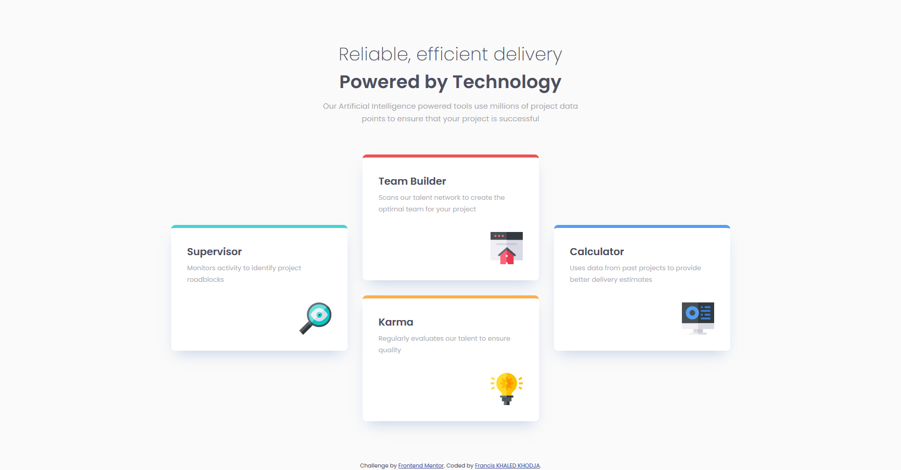
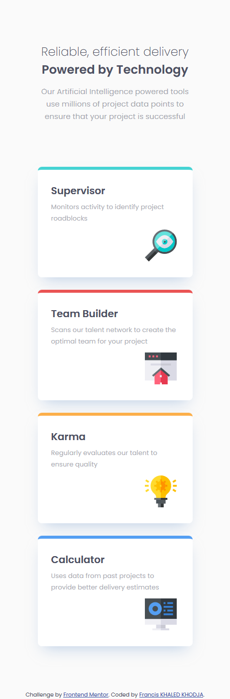

# Frontend Mentor - Four card feature section solution

This is a solution to the [Four card feature section challenge on Frontend Mentor](https://www.frontendmentor.io/challenges/four-card-feature-section-weK1eFYK). Frontend Mentor challenges help you improve your coding skills by building realistic projects. 

## Table of contents

- [Overview](#overview)
  - [The challenge](#the-challenge)
  - [Screenshot](#screenshot)
  - [Links](#links)
- [My process](#my-process)
  - [Built with](#built-with)
  - [What I learned](#what-i-learned)
  - [Useful resources](#useful-resources)
- [Author](#author)

## Overview

### The challenge

Users should be able to:

- View the optimal layout for the site depending on their device's screen size

### Screenshot

### Links

- Solution URL: [github.io](https://franciskhaledkhodja.github.io)

## My process

### Built with

- Semantic HTML5 markup
- CSS custom properties
- Flexbox

### What I learned

The use of flexbox technic to place the elements. Small difficulty with the margin between the cards: with flexbox, i have the feeling that the margins add up between the cards.

### Useful resources

- [Guide Flexbox](https://css-tricks.com/snippets/css/a-guide-to-flexbox/)

## Author

- Github - [@FrancisKhaledKhodja](https://github.com/FrancisKhaledKhodja)
- Frontend Mentor - [@FrancisKhaledKhodja](https://www.frontendmentor.io/profile/yourusername)
- Linkedin - [@FrancisKhaledKhodja](https://linkedin.com/in/francis-khaled-khodja-249b69113)

