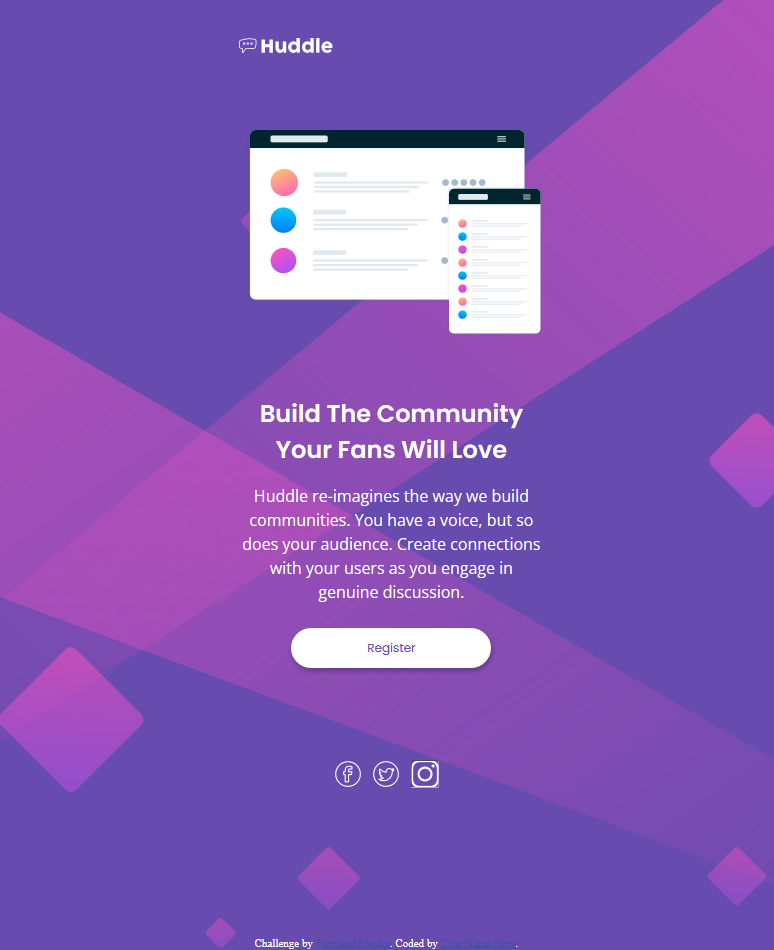

# Frontend Mentor - Huddle landing page with single introductory section solution

This is a solution to the [Huddle landing page with single introductory section challenge on Frontend Mentor](https://www.frontendmentor.io/challenges/huddle-landing-page-with-a-single-introductory-section-B_2Wvxgi0). Frontend Mentor challenges help you improve your coding skills by building realistic projects. 

## Table of contents

- [Overview](#overview)
  - [The challenge](#the-challenge)
  - [Screenshot](#screenshot)
  - [Links](#links)
- [My process](#my-process)
  - [Built with](#built-with)
  - [What I learned](#what-i-learned)
  - [Continued development](#continued-development)
- [Author](#author)

**Note: Delete this note and update the table of contents based on what sections you keep.**

## Overview

### The challenge

Users should be able to:

- View the optimal layout for the page depending on their device's screen size
- See hover states for all interactive elements on the page

### Screenshot

### Links

- Solution URL: [github.io](https://franciskhaledkhodja.github.io)

## My process

### Built with

- Semantic HTML5 markup
- CSS custom properties
- Flexbox
- CSS Grid

### What I learned

Mix Grid and Flex
Use of SVG (difficulties to change color)
Begin to use transition for the transition of color when I hover an element

### Continued development

Improve myself in more responsive page design

## Author

- Github - [@FrancisKhaledKhodja](https://github.com/FrancisKhaledKhodja)
- Frontend Mentor - [@FrancisKhaledKhodja](https://www.frontendmentor.io/profile/yourusername)
- Linkedin - [@FrancisKhaledKhodja](https://linkedin.com/in/francis-khaled-khodja-249b69113)

