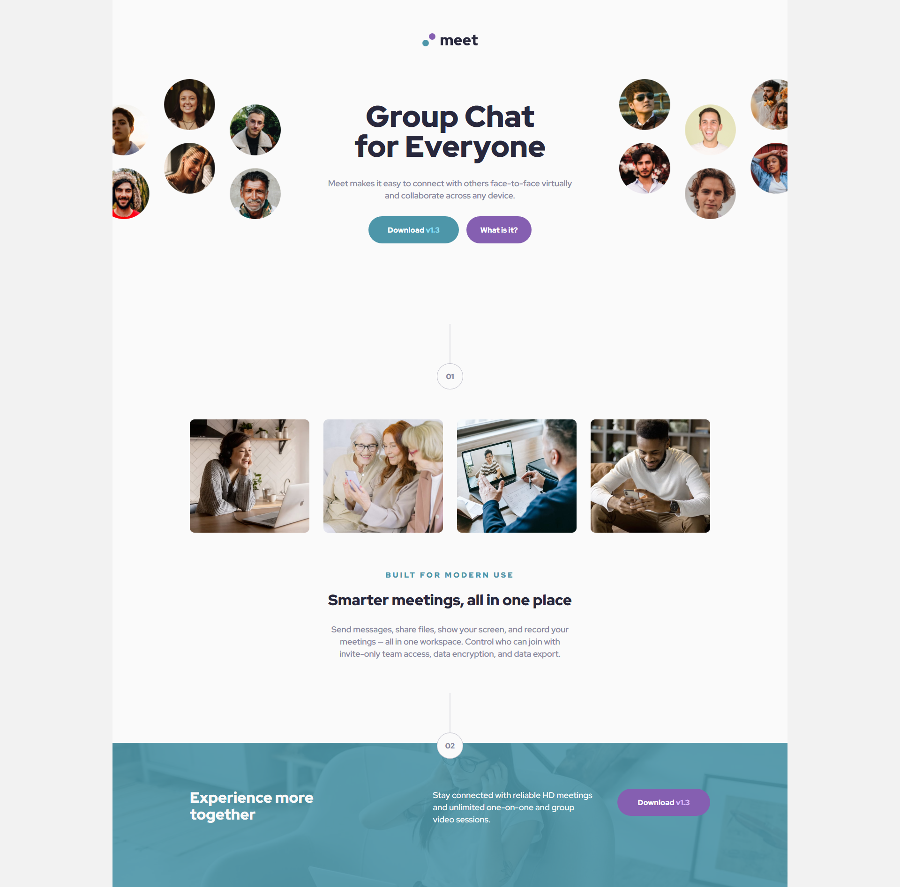
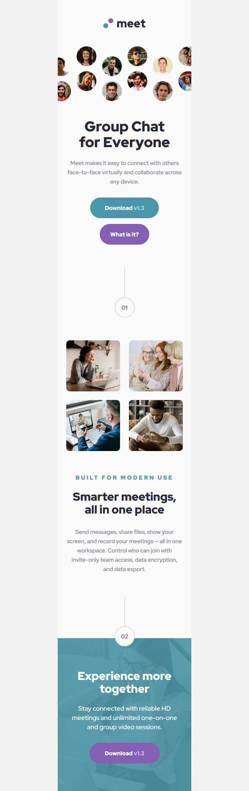
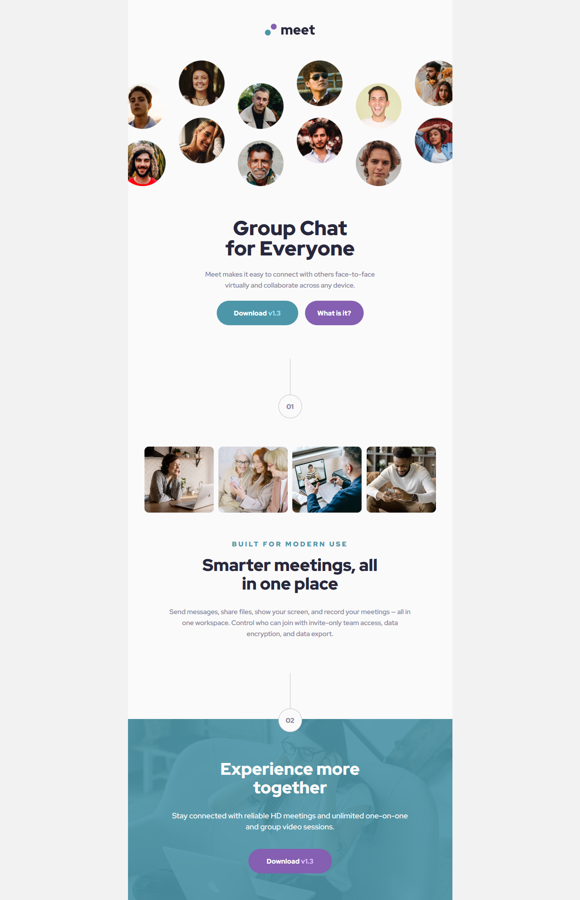

# Frontend Mentor - Meet landing page solution

This is a solution to the [Meet landing page challenge on Frontend Mentor](https://www.frontendmentor.io/challenges/meet-landing-page-rbTDS6OUR). Frontend Mentor challenges help you improve your coding skills by building realistic projects. 

## Table of contents

- [Overview](#overview)
  - [The challenge](#the-challenge)
  - [Screenshot](#screenshot)
  - [Links](#links)
- [My process](#my-process)
  - [Built with](#built-with)
  - [Useful resources](#useful-resources)
- [Author](#author)

## Overview

### The challenge

Users should be able to:

- View the optimal layout depending on their device's screen size
- See hover states for interactive elements

### Screenshot

### Links

- Solution URL: [github.io](https://franciskhaledkhodja.github.io)

## My process

### Built with

- Semantic HTML5 markup
- CSS custom properties
- Flexbox
- Mobile-first workflow

### Useful resources

- [Example resource 1](https://stackoverflow.com/questions/11392312/zero-width-non-breaking-space) - This helped me for non breaking space in a text.

## Author

- Github - [@FrancisKhaledKhodja](https://github.com/FrancisKhaledKhodja)
- Frontend Mentor - [@FrancisKhaledKhodja](https://www.frontendmentor.io/profile/yourusername)
- Linkedin - [@FrancisKhaledKhodja](https://linkedin.com/in/francis-khaled-khodja-249b69113)

