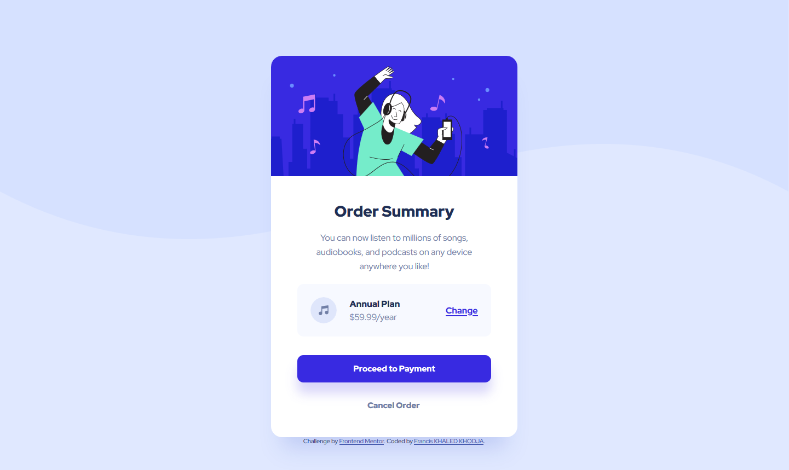

# Frontend Mentor - Order summary card solution

This is a solution to the [Order summary card challenge on Frontend Mentor](https://www.frontendmentor.io/challenges/order-summary-component-QlPmajDUj). 

## Table of contents

- [Overview](#overview)
  - [The challenge](#the-challenge)
  - [Screenshot](#screenshot)
  - [Links](#links)
- [My process](#my-process)
  - [Built with](#built-with)
  - [What I learned](#what-i-learned)
- [Author](#author)
- [Acknowledgments](#acknowledgments)

## Overview

### The challenge

Users should be able to:

- See hover states for interactive elements

### Screenshot

### Links

- Solution URL: [githu.io](https://franciskhaledkhodja.github.io/)

## My process

I am a python programmer and I am a beginner in html and css.
I made these pages (desktop and mobile) with html markup and classic CSS. 
I didn't use flexbox or grid because I don't know these technics yet.

### Built with

- Semantic HTML5 markup
- CSS custom properties

### What I learned

My difficulties has been to manipulate and use correctly **display** and **position** in the CSS.
I learned in this project the media queries's notion too.

## Author

- Linkedin - [Francis KHALED KHODJA](https://linkedin.com/in/francis-khaled-khodja-249b69113)
- Frontend Mentor - [@FrancisKhaledKhodja](https://www.frontendmentor.io/profile/FrancisKhaledKhodja)
- github - [My GitHub](https://github.com/FrancisKhaledKhodja)

