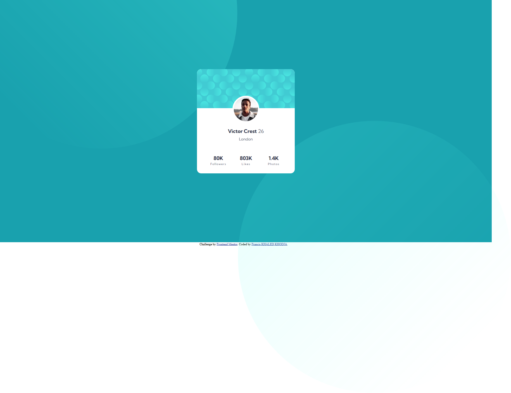
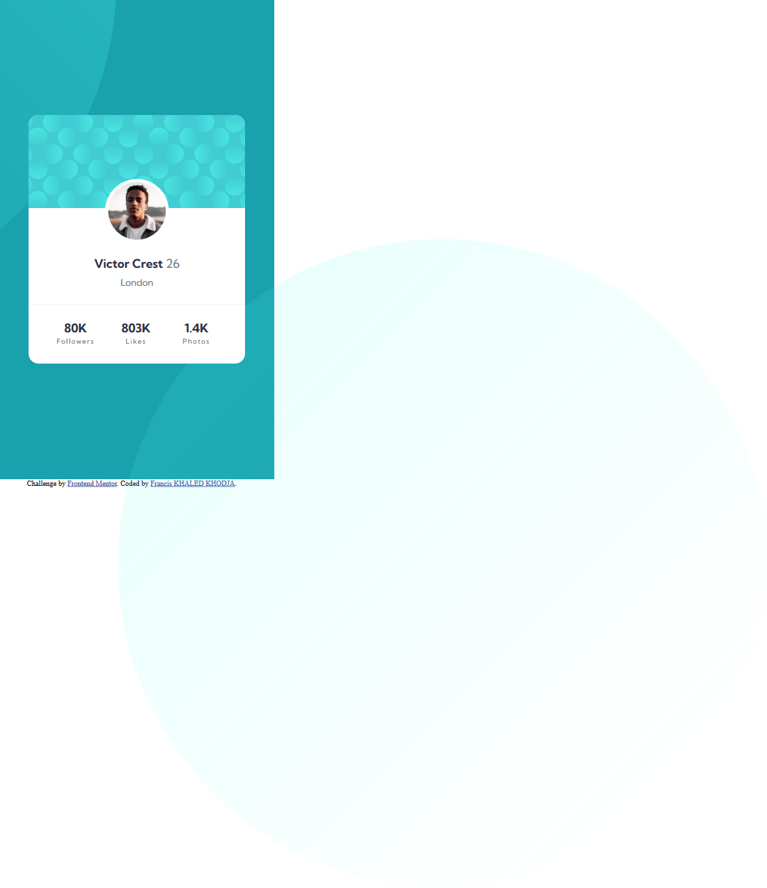

# Frontend Mentor - Profile card component solution

This is a solution to the [Profile card component challenge on Frontend Mentor](https://www.frontendmentor.io/challenges/profile-card-component-cfArpWshJ). Frontend Mentor challenges help you improve your coding skills by building realistic projects. 

## Table of contents

- [Overview](#overview)
  - [The challenge](#the-challenge)
  - [Screenshot](#screenshot)
  - [Links](#links)
- [My process](#my-process)
  - [Built with](#built-with)
  - [What I learned](#what-i-learned)
- [Author](#author)

## Overview

### The challenge

- Build out the project to the designs provided

### Screenshot

### Links

- Solution URL: [Github.io](https://FrancisKhaledKhodja.github.io/profile-card-component-main)

## My process

### Built with

- Semantic HTML5 markup
- CSS custom properties
- CSS Grid

### What I learned

I begin to learn and I use it grid to place my elements on the screen.

My difficulty was to compute the row's GRID of the card and to place correctly the svg background: when I change the size of the screen the position of the svg must not move relative to the card.  

## Author

- Frontend Mentor - [@FrancisKhaledKhodja](https://www.frontendmentor.io/profile/FrancisKhaledKhodja)

